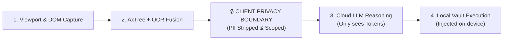

# 🛡️ Vidur Live Demo & Pitch Script

> **The Pitch in One Sentence**: *"Existing browser agents send your raw screen, cookies, and cleartext passwords to remote LLM clouds. Vidur gives AI full autonomous browser agency while guaranteeing **Zero PII Data Leakage** through on-device schema sanitization and encrypted WebCrypto vault execution."*

---

## 📋 Pre-Demo Checklist & Setup (2 Minutes Before Pitch)

1. **Start the Vidur Backend & Dev Server**:
   ```bash
   cd server
   npm run dev
   ```
   *Verify it outputs:* `Vidur server running on http://localhost:3000`

2. **Load the Chrome Extension**:
   - Open Chrome $\rightarrow$ `chrome://extensions/`
   - Turn on **Developer mode** (top right toggle).
   - Click **Load unpacked** $\rightarrow$ select `c:\Users\kumar\Desktop\Vidur\extension`.
   - Pin the **Vidur** extension badge to your browser toolbar.

3. **Initialize the Profile Vault**:
   - Click the Vidur Extension icon in Chrome (or open the Side Panel).
   - Switch to the **Vault** tab (`🔐`).
   - Enter Master Passphrase: `password123` $\rightarrow$ Click **Create Vault / Unlock**.
   - Verify standard profile fields are populated (Name: *Jane Doe*, Email: *developer@vidur.ai*, Phone: *+1 555-0199*, Address: *123 Tech Blvd*, Password: *SuperSecretPassword123!*).

4. **Verify Demo Mode Toggle**:
   - In the extension header, ensure the **Demo** switch is available.
   - *Tip for Live Pitch*: On stable localhost, keep Demo Mode OFF to demonstrate real-time Claude 3.5 Sonnet / Reasoner API calls. If presenting on hotel/conference wifi, toggle Demo Mode ON to ensure instant offline execution.

---

## 🎬 5-Minute Pitch & Demo Script



---

### Scenario 1: The "Zero-Leak" Authenticated Login
**Core Theme**: *Proving zero credential leakage to the cloud with the Side-by-Side Privacy Inspector.*

#### Step 1: Open Target Page
- Navigate to: [`http://localhost:3000/test/login-test.html`](http://localhost:3000/test/login-test.html)
- Show the audience the login screen with Email and Password input fields.

#### Step 2: Show the Privacy Guard in Action (The "Aha!" Moment)
- Open the Vidur Side Panel $\rightarrow$ Click the **Privacy** tab (`🛡️`).
- Click **"Capture & Inspect Privacy Schema"**.
- **What to Highlight on Screen**:
  - Point to the **Green Shield Banner**: *"2 PII Values Redacted & Protected"*.
  - Show the **Side-by-Side Comparison Grid**:
    - **Left (`RAW DOM SCHEMA`)**: Highlight that the local DOM contains the raw attributes and input definitions.
    - **Right (`SANITIZED SCHEMA`)**: Show the glowing green tokens:
      ```json
      {
        "id": "el_0",
        "tag": "input",
        "type": "email",
        "value": "{{FIELD:EMAIL_1}}"
      },
      {
        "id": "el_1",
        "tag": "input",
        "type": "password",
        "value": "{{FIELD:PASSWORD_1}}"
      }
      ```
  - **Speaker Note**:
    > *"Notice this glowing green token `{{FIELD:EMAIL_1}}`. The cloud LLM never receives the user's actual email or password. It reasons purely over abstract topological tokens."*

#### Step 3: Autonomous Execution & Token Injection
- Switch to the **Task** tab (`⚡`).
- Click the **"🔑 Login Form"** preset pill (or type `log in with my account`).
- Click **"Start Autonomous Agent"**.
- **What the Agent Log & Screen Show**:
  - `[CAPTURING]` Extracts DOM accessibility tree.
  - `[SANITIZING]` Scopes email and password into `{{FIELD:EMAIL_1}}` and `{{FIELD:PASSWORD_1}}`.
  - `[🧠 LLM Reasoning]` Claude 3.5 plans: `Type {{FIELD:EMAIL_1}} into #el_0, type {{FIELD:PASSWORD_1}} into #el_1, click #el_5`.
  - `[▶ ACTION: TYPE]` Resolves `{{FIELD:EMAIL_1}}` $\rightarrow$ `developer@vidur.ai` from the local WebCrypto vault.
  - `[▶ ACTION: TYPE]` Resolves `{{FIELD:PASSWORD_1}}` $\rightarrow$ `SuperSecretPassword123!` locally.
  - `[🎉 Task Done]` Page transitions to **"Authentication Successful! Welcome Jane Doe"**.

---

### Scenario 2: Autonomous E-Commerce Search & Safety Approval Gate
**Core Theme**: *Multi-step autonomous reasoning loop combined with Human-in-the-Loop financial safety controls.*

#### Step 1: Open Target Page
- Navigate to: [`http://localhost:3000/test/search-test.html`](http://localhost:3000/test/search-test.html)

#### Step 2: Launch Autonomous Goal
- Open the Vidur Side Panel $\rightarrow$ **Task** tab.
- Click the preset: **"🔍 Search Headphones"** (or type `search for wireless headphones`).
- Click **"Start Autonomous Agent"**.

#### Step 3: Observe Autonomous Execution
- **What the Agent Log & Screen Show**:
  - **Iteration 1**:
    - `[▶ ACTION: TYPE]` Types `"wireless headphones"` into `#searchQuery`.
    - `[▶ ACTION: CLICK]` Clicks `#searchSubmitBtn`.
    - Page re-renders with 4 live product cards (e.g., *Sony WH-1000XM5, Bose QuietComfort, AirPods Max*).
  - **Iteration 2**:
    - `[▶ ACTION: CLICK]` Adds *Sony WH-1000XM5* to cart.
    - `[🎉 Task Done]` Search results populated and item placed in cart.

#### Step 4: Highlight Human-in-the-Loop Safety Gate
- Type: `proceed to checkout and submit payment of $99` into the task input.
- Click **"Start Autonomous Agent"**.
- **What to Highlight on Screen**:
  - The yellow **Human-in-the-Loop Approval Banner** pops up in the extension!
  - Displays: `⚠️ Action requires user confirmation | [CLICK] on "Submit Payment"`.
  - Point out:
    > *"Vidur features built-in safety classifiers. The agent will never autonomously execute financial, destructive, or irrevocable transactions without explicit human approval."*
  - Click **"✅ Approve Action"** $\rightarrow$ Agent completes checkout.

---

### Scenario 3: Zero-Shot Multi-Field Enterprise Form
**Core Theme**: *Handling complex, multi-field unseen forms with resilience to network dropouts and dynamic page changes.*

#### Step 1: Open Target Page
- Navigate to: [`http://localhost:3000/test/contact-test.html`](http://localhost:3000/test/contact-test.html)

#### Step 2: Launch Multi-Field Fill
- Open the Vidur Side Panel $\rightarrow$ **Task** tab.
- Click the preset: **"📝 Contact Form"** (or type `submit enterprise inquiry for our team`).
- Click **"Start Autonomous Agent"**.

#### Step 3: What to Highlight on Screen & in Log
- **What the Agent Log Shows**:
  - `[▶ ACTION: TYPE]` Resolves `{{FIELD:NAME_1}}` $\rightarrow$ `Jane Doe`
  - `[▶ ACTION: TYPE]` Resolves `{{FIELD:EMAIL_1}}` $\rightarrow$ `developer@vidur.ai`
  - `[▶ ACTION: TYPE]` Resolves `{{FIELD:PHONE_1}}` $\rightarrow$ `+1 555-0199`
  - `[▶ ACTION: TYPE]` Resolves `{{FIELD:ADDRESS_1}}` $\rightarrow$ `123 Tech Avenue, Bengaluru`
  - `[▶ ACTION: TYPE]` Enters inquiry message: *"Requesting enterprise security and autonomous browser automation demo for our team."*
  - `[▶ ACTION: CLICK]` Submits the form.
  - Page displays **"✅ Thank you! Your enterprise inquiry has been received."**

#### Step 4: Show Pitch Visual Aid (How It Works)
- Click the **ℹ️** (How It Works) button in the top navigation bar.
- The **5-Stage Pipeline Modal** opens over the panel.
- Point to the central **Zero-Leak Privacy Boundary**:
  > *"Every step before this line happens on the user's device. The cloud LLM only handles high-level logical reasoning, while the browser extension handles deterministic execution and credential resolution."*

---

## ⚡ Demo-Day FAQ & Pitch Q&A

### Q1: *"How is Vidur different from OpenAI Operator or Claude Computer Use?"*
> **Answer**: *"Claude Computer Use and OpenAI Operator take full-resolution screenshots of the user's screen and send them directly to cloud servers. If your screen contains an email, API key, customer record, or banking session, that data leaves your perimeter. Vidur extracts a structural schema, redacts all PII locally using Luhn algorithms, regex, and DOM analysis, and only sends anonymized placeholder tokens. Real credentials never leave the browser."*

### Q2: *"What happens if an element moves or changes ID dynamically?"*
> **Answer**: *"Vidur's Local Action Executor implements fuzzy DOM matching (matching by tag, role, aria-label, and placeholder text) and detects stale elements. If an element disappears between planning and execution, Vidur catches it gracefully, flags it in the activity feed, and automatically re-captures the updated DOM on the next iteration without crashing."*

### Q3: *"Where are passwords and profile data stored?"*
> **Answer**: *"In a local IndexedDB profile vault encrypted with AES-GCM 256-bit cryptography via the WebCrypto API. The encryption key is derived on-device from the user's master passphrase using PBKDF2 with SHA-256 and a random salt. Neither Vidur's servers nor the LLM have access to the master key."*

---

## 🎯 Summary of Key Endpoints & Test Pages

| Page / Endpoint | Purpose | URL |
| :--- | :--- | :--- |
| **Search Playground** | Product search, filtering & cart testing | `http://localhost:3000/test/search-test.html` |
| **Login Playground** | Credential injection & password protection | `http://localhost:3000/test/login-test.html` |
| **Contact Playground** | Multi-field enterprise inquiry testing | `http://localhost:3000/test/contact-test.html` |
| **Health Check** | Backend status & reachability | `http://localhost:3000/health` |
| **Reasoning Engine** | Anthropic Claude 3.5 Sonnet / Planner | `POST http://localhost:3000/plan-action` |
